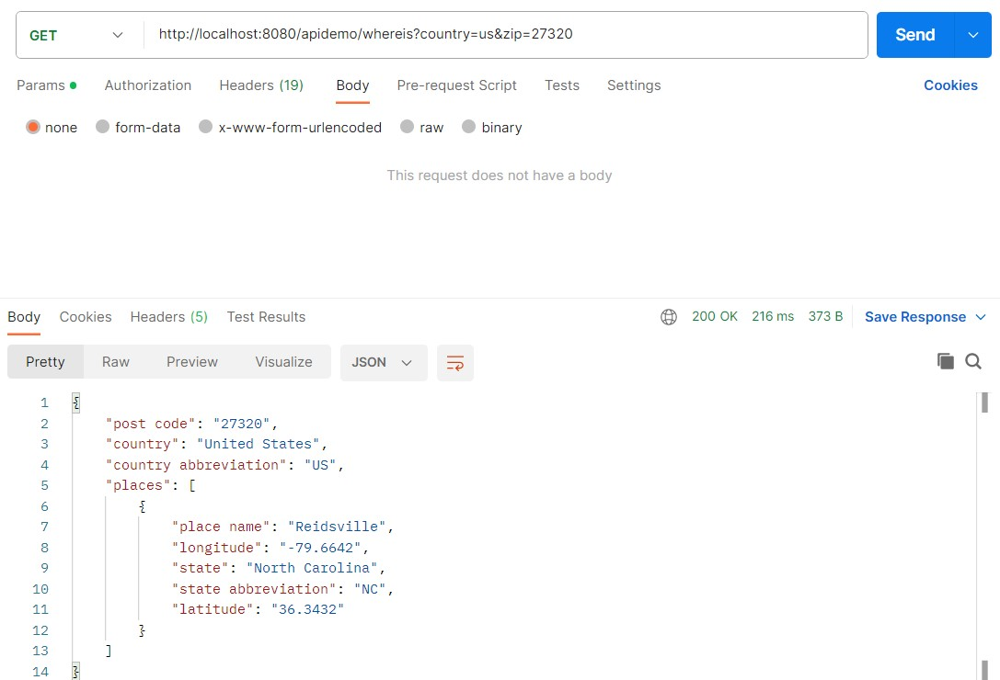

# CSC 340 Assignment 2

## API Demo Application

-This is a zip code lookup API demo using the free API at zippopotam.us.
-The program outputs the results from a preset request for zip code 27214 to the console, but also provides an endpoint for customer requests. 
-The endpoint is available to test at:
 * http://localhost:8080/apidemo/whereis

### Parameters:
* country (defualt value: us)
* zip (default value 27214)

### Usage Example:
http://localhost:8080/apidemo/whereis?country=us&zip=27320
Response:
